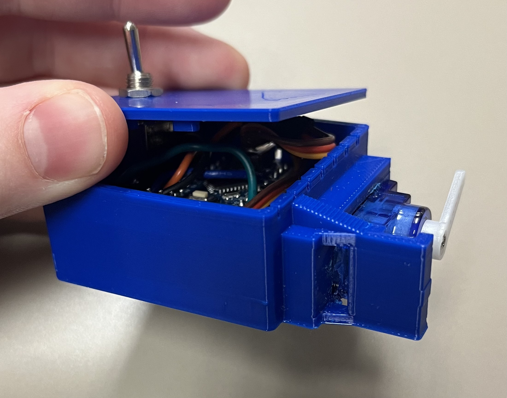

# Ultrasonic Cleaner Servo Button Actuator (UCB) by Nicholas Bratvold

## Overview
The Ultrasonic Cleaner Servo Button Actuator (UCB) is a project developed by Nicholas Bratvold to enhance the functionality of ultrasonic cleaners by automating button presses using a servo motor. This open-source project aims to provide an affordable and customizable solution for users looking to automate their ultrasonic cleaning processes.

## Features
- __Button Automation:__ The UCB uses a servo motor to press the buttons on ultrasonic cleaner devices, allowing for hands-free operation.
- __Compact Design:__ The hardware design is compact and can be easily integrated into existing ultrasonic cleaner setups.

## Hardware Requirements
To implement the UCB, you will need the following hardware:

- __Arduino board__ (e.g., Arduino Nano)
- __SG-90 Servo Motor__

## Getting Started
__Clone the Repository:__
Open a terminal or command prompt on your local machine;

```bash
git clone https://github.com/UBC-Brewing-Internet-of-Things/Ultrasonic-Cleaner-Servo-Button-Actuator.git
```

__Install Dependencies:__
Ensure that you have the necessary Arduino libraries installed. Refer to the documentation [here](https://www.arduino.cc/en/Guide) for details.

__Connect Hardware:__
Connect the servo motor to the designated pins on the Arduino board and ensure proper wiring with the ultrasonic cleaner.  

__Upload Code:__
Open the Arduino IDE, load the UCB code, and upload it to your Arduino board.

__Run the UCB:__
Power on your ultrasonic cleaner and Arduino board. The UCB will automate the button presses according to the programmed sequence.

## CAD Files
We've 3D-printed a compact enclosure to house the UCB system, ensuring a tidy and secure setup for seamless integration into your ultrasonic cleaning workflow.

Click [here](https://cad.onshape.com/documents/cc328801bbe54f035c3b7bfe/w/303cb7792c4bb231bbfc453c/e/3c9fc0f5cdcdb3211f134436?renderMode=0&uiState=655960af94201b62afda7c2c) for access to the CAD files

## Prototypes
This is our current setup:




